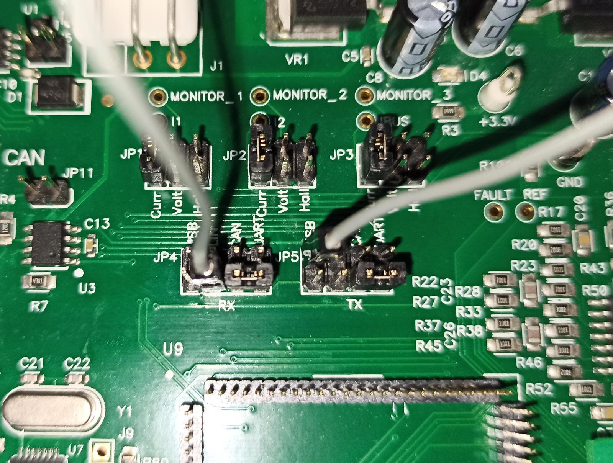
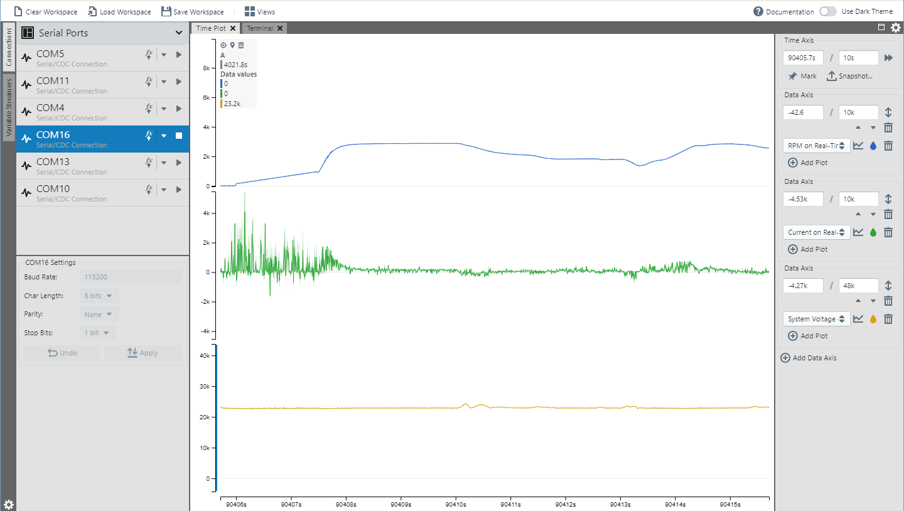
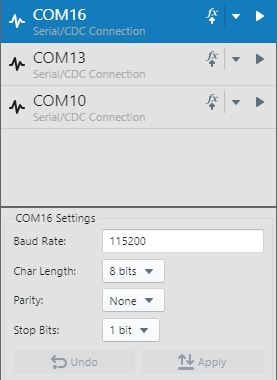
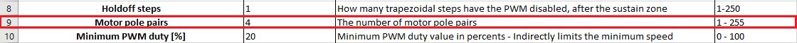
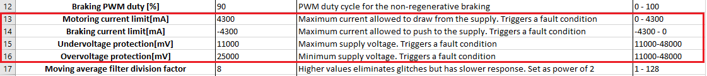
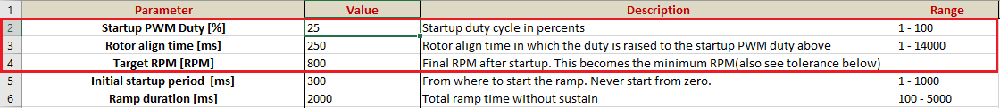

<!-- Please do not change this logo with link -->

 # AVR128DB48 MCLV-2 Motor Control

This folder contains the firmware used for the MCLV-2 AVR DX PIM with the AVR128DB48 microcontroller described in the [AN3998 - Sensorless BLDC Motor Control for AVR® Microcontrollers](https://www.microchip.com/wwwappnotes/appnotes.aspx?appnote=en1006125) application note. This PIM is used to drive a BLDC motor in bipolar trapezoidal control.
The AVR® DB PIM version is very similar to the AVR DA version, but it uses an internal op amp found only on the AVR DB family for the current sensing.
The motor can be spun either in closed loop or open loop, which is set through a macro at compile time. After initialization, the code will be in STOP state and it can be started by pressing the **S2** button on the MCLV-2 board.
After a short ramp-up sequence which is similar to the open loop operation, the motor will switch to the desired control mode and continue spinning. The potentiometer on the MCLV-2 board sets the speed of the motor.

## Related Documentation

- [AN3998 - Sensorless BLDC Motor Control for AVR® Microcontrollers](https://www.microchip.com/wwwappnotes/appnotes.aspx?appnote=en1006125)
- [AVR128DB48 Product Page](https://www.microchip.com/wwwproducts/en/AVR128DB48)
- [AVR128DB48 Code Examples on GitHub](https://github.com/microchip-pic-avr-examples?q=avr128db48)
- [AVR128DB48 Project Examples in START](https://start.atmel.com/#examples/AVR128DB48CuriosityNano)

## Software Used
- MPLAB® X IDE 5.40 or newer [(microchip.com/mplab/mplab-x-ide)](http://www.microchip.com/mplab/mplab-x-ide)
- MPLAB® XC8 2.20 or a newer compiler [(microchip.com/mplab/compilers)](http://www.microchip.com/mplab/compilers)
- MPLAB® Code Configurator (MCC) 4.0.2 or newer [(microchip.com/mplab/mplab-code-configurator)](https://www.microchip.com/mplab/mplab-code-configurator)
- MPLAB® Code Configurator (MCC) Device Libraries 8-bit AVR® MCUs 2.5.0 or newer [(microchip.com/mplab/mplab-code-configurator)](https://www.microchip.com/mplab/mplab-code-configurator)
- AVR DX 1.6.88 or newer Device Pack

## Hardware Used
- [MCLV-2](https://www.microchip.com/developmenttools/ProductDetails/PartNo/DM330021-2?utm_source=MicroSolutions&utm_medium=Article&utm_content=DevTools&utm_campaign=StandAlone)
- AVR DX PIM
- [PICKit4](https://www.microchip.com/developmenttools/ProductDetails/PG164140)

## Setup

##### Board Setup

If the stock external op amp configuration board is used, then place jumper JP1, JP2 and JP3 to position "Volt".

If the external op amp configuration board provided with the motor control PIM is used, then the jumpers JP1, JP2 and JP3 can be left at any position.

To switch between the internal and external amplified current reading, a 0 Ohm resistor can be soldered on either J2 (internal) or J3 (external) on the PIM PCB.

##### Serial Interface

Due to a known design error, the RX and TX have to be switched to receive data. 

The PIM can only send data, so only one female-female wire is needed. 

The following picture shows how to connect the wire:
 

##### Programmer
The following programmers are supported:
   - Atmel ICE
   - MPLAB SNAP
   - PICKit™ 4 - recommended

To connect the PICKit 4 to the MCLV-2, solder the J12 header and plug in the PICKit4 making sure to align the arrow from the PICKit4 to the one on the MLCV-2.

 ## Operation
 
 1. Connect the PICKit 4 Programmer to MCLV-2 and PC.

 2. Open the avr128db48-mclv2-pim-motor-control-mcc.X project in MPLAB X.

 3. Set the avr128db48-mclv2-pim-motor-control-mcc.X project as the main project. Right click on the project in the **Projects** tab and click **Set as Main Project**.

 

 4. Clean and build the avr128db48-mclv2-pim-motor-control-mcc.X project: Right click on the **avr128db48-mclv2-pim-motor-control-mcc.X** project and select **Clean and Build**.

 

 5. Select the programming tool in the Connected Hardware Tool section of the Project Settings:
   - Right click on the project and click **Properties**;
   - Click on the arrow right next to Connected Hardware Tool;
   - Select the programming tool (click on the **SN**), click **Apply** and then click **OK**:
   
 

 6. Program the project to the board: Right click on the project and click **Make and Program Device**.

 

 7. To start the motor, press the **S2** button.
  - **S3** changes the direction of the motor. Motor direction can be changed only in the **STOP** state.
  - If the motor is running, **S2** brings the system to the **STOP** state.
  - If the system is in the **FAULT MODE** state, the PWM  LEDs are turned off. One press of the button **S2** brings the system to the **STOP** state.

##### MPLAB Data Visualizer
 

To use the MPLAB Data Visualizer, the following steps have to be followed:

1. Connect the MCLV-2 board to the PC using a mini-USB cable.

2. Make sure that the MPLAB Data Visualizer plug-in is installed.
 - Go to **Tools** → **Plugins** → **Available plug-ins** and search for "MPLAB Data Visualizer".

3. Launch the MPLAB Data Visualizer and click on **Load Workspace** from the top bar. Select the **AVR-Dx_data_visualizer_config.json** file in the folder for the selected device.

4. On the left tab **Connections**, select the desired COM port and set the Baud Rate to 115200. Leave the rest of the configuration as in the image below:
 

5. Press the **Start streaming** button for the selected COM port. To view the traces on the Time Plot, the **Show Live Data** mode must be activated.

- If debug messages are enabled (see app.c source file macros) they can be viewed in the **Terminal** tab, with the Display As mode set to "8-bit ASCII".

## First Start-up
 1. Open the provided Excel file and enable the macros.

 2. On the sheet "Safe Values", set the **Motor pole pairs** to match the pole pairs of the attached motor.
  

 3. Click the **Patch file** button.
  

 4. In MPLAB X, clean and build the avr128db48-mclv2-pim-motor-control-mcc.X project: Right click on the **avr128db48-mclv2-pim-motor-control-mcc.X** project and select **Clean and Build**.

 5. Program the project to the board: Right click the project and click **Make and Program Device**.

## Tuning
If the motor is not able to start, the system must be tuned using the provided Excel configuration file.

1. First, check the protection values and make sure the system is within the set limits.
  

2. If the motor is not able to follow the generated open-loop field, the **Startup PWM Duty** parameter must be increased, or the **Target RPM** lowered. Beware that lowering the target start-up RPM may reduce the BEMF amplitude which makes it impossible to detect the zero-cross point.
  

## Summary

The firmware for the AVR128DB48 motor control PIM is provided in this folder together with an Excel file to configure all the parameters easily and a workspace file for the MPLAB Data Visualizer plug-in to see the real time data for the running motor. 
